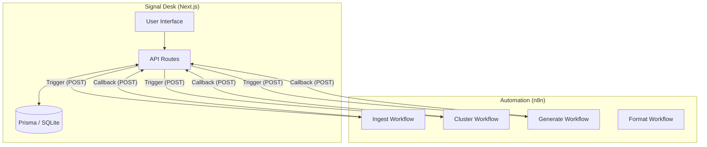

# Core Perigee (Signal Desk)

Core Perigee is a personal **Signal-to-Insight Operating System** designed to help you capture, process, and transform raw information (signals) into structured, actionable insights and social content.

## 🏗 Architecture Overview

Core Perigee is designed as a **decoupled, event-driven system** that separates user interaction from heavy-duty AI processing. This architecture allows for a responsive UI while complex workflows occur asynchronously in the background.

### System Components

1.  **Next.js Frontend (App Router)**:
    *   Serves as the primary Command Center.
    *   Handles UI for signal capture, manual review, and insight management.
    *   Uses **SWR** for real-time UI updates and data fetching.
    *   Implements **API Routes** as a gateway for both the frontend and external webhook callbacks.

2.  **Data Layer (Prisma + SQLite)**:
    *   Uses **SQLite** for local, high-performance data storage.
    *   **Prisma ORM** provides type-safe database access and handles schema migrations.
    *   The schema is designed to maintain relational integrity between raw signals, user thoughts, and synthesized insights.

3.  **Orchestration Layer (n8n & Webhooks)**:
    *   Core logic for AI processing is offloaded to external **n8n workflows**.
    *   Communication is handled via outbound webhooks (triggered by the app) and inbound callbacks (updates from n8n).
    *   This allows for easy modification of the AI logic without redeploying the core application.

### Data Flow Pipeline

The system follows a linear progression from raw data to published content:

1.  **Ingestion**: Raw inputs (text, URLs, YouTube links) are sent to the `Ingest` webhook. n8n extracts content, generates summaries, and identifies key entities, which are then saved as **Signals**.
2.  **Review**: The user reviews Signals in the **Review Queue**, adding **Highlights** and **Thoughts** to refine the information.
3.  **Clustering**: Related signals are grouped together via the `Cluster` webhook to identify underlying themes or "Signal Clouds."
4.  **Synthesis**: The `Generate` webhook processes these clusters to synthesize a **Core Insight**.
5.  **Distribution**: The `Format` and `Publish` webhooks prepare the insight for specific platforms (LinkedIn, Twitter, etc.) and handle the final posting.

### Database Schema

The core domain model consists of:

-   **Signal**: The atomic unit of information. Contains raw content, source metadata, and processing status.
-   **Highlight**: Specific, granular points extracted from a Signal during review.
-   **Thought**: User-generated reflections or notes that can be linked to either a Signal or an Insight.
-   **Insight**: The high-level synthesis of multiple Signals and Thoughts.
-   **WebhookConfig**: Dynamic configuration for external service URLs, managed via the Settings UI.




## 🚀 Getting Started

Follow these steps to set up the project locally.

### Prerequisites
- [Node.js](https://nodejs.org/) (v18 or higher recommended)
- [npm](https://www.npmjs.com/) or [yarn](https://yarnpkg.com/)

### Installation

1. **Clone the repository**:
   ```bash
   git clone <repository-url>
   cd core-perigee
   ```

2. **Install dependencies**:
   ```bash
   npm install
   ```

3. **Database Setup**:
   Initialize the SQLite database and generate the Prisma client:
   ```bash
   npx prisma generate
   npx prisma migrate dev --name init
   ```

4. **Configuration**:
   The application relies on webhooks for advanced processing. Once the app is running, navigate to the **Settings** page in the UI to configure your webhook URLs for:
   - **Ingest**: Processing raw input (URLs, text).
   - **Cluster**: Grouping related signals.
   - **Generate**: AI-driven insight creation.
   - **Format**: Social media post formatting.
   - **Publish**: Finalizing and posting content.

### Development

Start the development server:
```bash
npm run dev
```

Open [http://localhost:3000](http://localhost:3000) to access the Signal Desk.

## 📂 Project Structure

- `src/app/`: Next.js App Router pages and API routes.
- `src/components/`: Reusable UI components.
- `src/lib/`: Core utilities, Prisma client, and webhook handlers.
- `prisma/`: Database schema and migrations.
- `scripts/`: Maintenance and utility scripts (e.g., `debug_webhooks.ts`).

## 🛠 Features

- **Signal Inbox**: Capture and manage raw information from various sources.
- **Thought Capture**: Attach quick notes and reflections to signals.
- **Insight Generation**: Transform groups of signals into cohesive insights via AI.
- **Processing Queue**: Track the progress of asynchronous tasks triggered by webhooks.
- **Social Integration**: Format and prepare insights for platforms like LinkedIn or Twitter.
